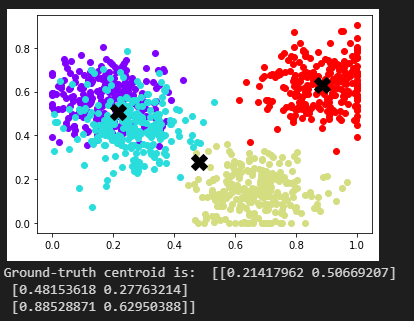

# crypten_ms
Implementation of a MPC-based Secure MeanShift Algorithm using Crypten.

## Requirement
crypten, scikit-learn, matplotlib

### Create Conda Environment

    conda create -n crypten python=3.6

    pip install crypten

    pip install scikit-learn

    pip install matplotlib

Disclaimer: Tested on several different Machines.

### To Run (adjust settings in run.sh)

    conda activate crypten

    bash run.sh

***

### Module 1

1. Generate random centers in a [0, 1], [0, 1] plane, for 4 centers.

2. Generate random clustered point, using gaussian distribution around each centers, 250 points for each center (marked by different color).

3. Use scikit-learn to get the ground-truth centroid (marked by X).

### Module 2

1. Randomly sample a small set of points as dusts, this step is essential to cut down the polynomial runtime. This would iccur error in the final centroids. According to paper xxx, this approximation is accurate enough with less than 1% error [[1]](#1).

2. Calculate the distance between point and dusts. Both are in the form of secret share.

### For the explanation for module 3 and 4, please check our report.

## References
<a id="1">[1]</a> 
Cheon, Jung Hee, Duhyeong Kim, and Jai Hyun Park. "Towards a practical cluster analysis over encrypted data." International Conference on Selected Areas in Cryptography. Springer, Cham, 2019.